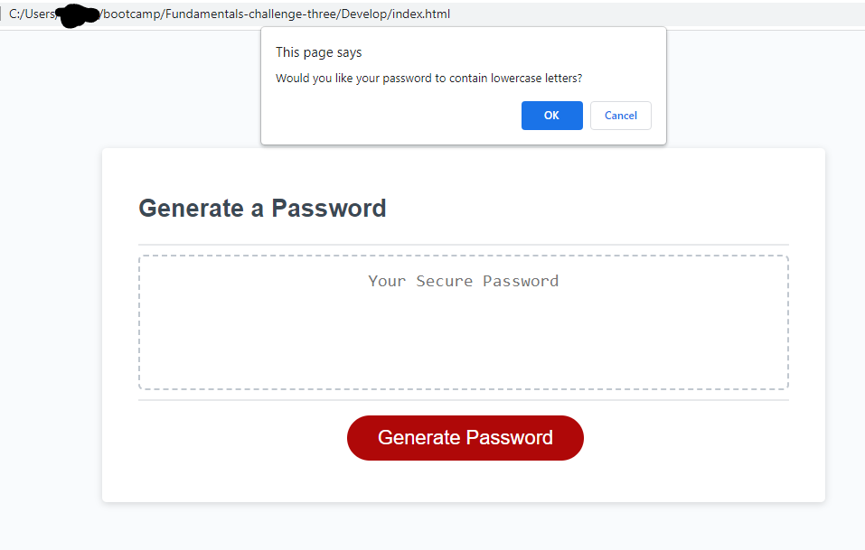

# Password Generator Starter Code

# Summary

The Module 3 assignment was to make a functional password generator

- HTML & CSS were given and remained untouched
  User Criteria fulfilled - password generator now functions properly;

GIVEN a user need a new, secure password
WHEN a user clicks the button to generate a password
the user is presented with a series of prompts for password criteria
WHEN prompted for password criteria
the user selects which criteria to include in the password
WHEN prompted for the length of the password
the user chooses a length of at least 8 characters and no more than 128 characters
WHEN prompted for character types to include in the password
the user chooses lowercase, uppercase, numeric, and/or special characters
WHEN the user answers each prompt
the user's input should be validated and at least one character type should be selected
WHEN all prompts are answered
a password is generated that matches the selected criteria
WHEN the password is generated
the password is either displayed in an alert or written to the page

